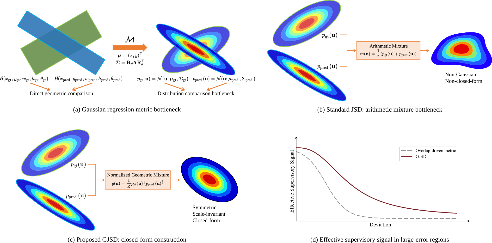
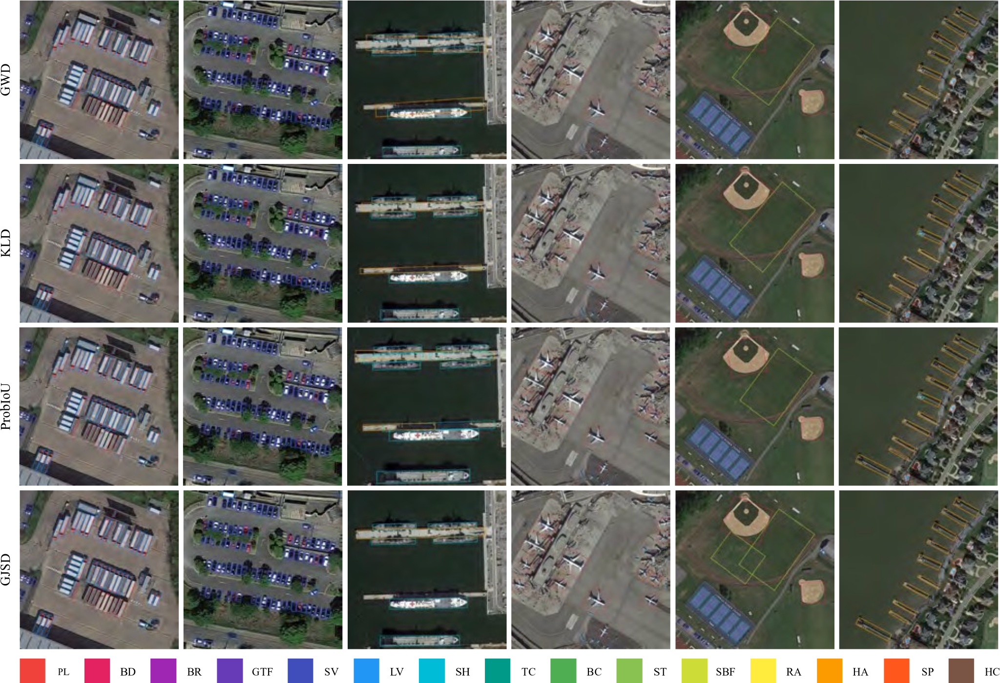

<div align="center">
  <h1>GJSD Loss for Oriented Object Detection in Remote Sensing Images</h1>
  <h3>Symmetric and Scale-Invariant Gaussian Regression</h3>
  <p>
    <b>Official implementation of GJSD Loss based on MMRotate</b><br>
    Repository status: code and training configs are provided; paper/citation information will be updated after publication.
  </p>
</div>

---

## Abstract

Gaussian-based bounding box regression provides a unified probabilistic formulation for oriented object detection in remote sensing images. Its effectiveness, however, largely depends on the metric used to compare the predicted and target Gaussian distributions. This project implements **Geometric Jensen--Shannon Divergence (GJSD) Loss**, a closed-form, symmetric, and scale-invariant Gaussian regression loss for oriented bounding box regression. By introducing a normalized geometric mixture in the precision-matrix domain, GJSD jointly measures center offsets, scale variations, and orientation errors while remaining compatible with existing MMRotate detectors.

---

<div align="center">
  <h3>Motivation and GJSD Construction</h3>
  
</div>


---

## Highlights

- **Closed-form Gaussian metric.** GJSD replaces the arithmetic mixture in standard JSD with a normalized geometric mixture, leading to an analytically tractable Gaussian-to-Gaussian divergence.
- **Symmetric comparison.** The predicted and target Gaussian distributions play symmetric roles during regression optimization.
- **Scale-invariant response.** Under isotropic coordinate scaling, the raw GJSD divergence and the bounded training loss remain unchanged.
- **Drop-in loss replacement.** The implementation only replaces the regression loss and does not modify the detector backbone, detection head, sample assignment, or inference pipeline.
- **MMRotate-compatible implementation.** GJSD configs and loss code are integrated into the MMRotate project structure.

---

## Qualitative Results

<div align="center">
  <h3>Detection Results on DOTA-v1.0</h3>
  
</div>


---

## Repository Structure

The main GJSD-related files are listed below.

```text
GJSD-Loss/
├── configs/
│   └── gjsd/
│       ├── roi-trans-r50_fpn_gjsd_1x_dota_le90_ms.py
│       └── s2anet_r50_fpn_gjsd_1x_dota_le135_ms.py
├── mmrotate/
│   └── models/
│       └── losses/
│           └── gaussian_dist_loss_v1.py
├── docs/
│   ├── fig1.png
│   └── fig3.png
├── tools/
│   ├── train.py
│   └── test.py
└── README.md
```

### Key Files

| File | Description |
| --- | --- |
| `mmrotate/models/losses/gaussian_dist_loss_v1.py` | Implementation of Gaussian distance losses, including `gjsd_loss` and `GDLoss_v1` / `GDLoss_v2`. |
| `configs/gjsd/roi-trans-r50_fpn_gjsd_1x_dota_le90_ms.py` | RoI Transformer + GJSD config for DOTA-v1.0. |
| `configs/gjsd/s2anet_r50_fpn_gjsd_1x_dota_le135_ms.py` | S$^2$A-Net + GJSD config for DOTA-v1.0. |
| `docs/fig1.png` | Motivation and construction diagram. |
| `docs/fig3.png` | Qualitative detection visualization. |

---

## Installation

This repository follows the MMRotate 1.x codebase. A typical installation is shown below.

```bash
conda create -n gjsd python=3.10 -y
conda activate gjsd

# Install PyTorch according to your CUDA version.
# Example for CUDA 11.8:
pip install torch==2.0.1 torchvision==0.15.2 --index-url https://download.pytorch.org/whl/cu118

# Install OpenMMLab dependencies.
pip install -U openmim
mim install mmengine
mim install "mmcv>=2.0.0rc4,<2.1.0"
mim install "mmdet>=3.0.0rc6,<3.2.0"

# Install this project.
pip install -v -e .
```

The experiments used in our development environment were run with PyTorch 2.0.1 + CUDA 11.8 on an NVIDIA RTX 3090. Other compatible MMRotate 1.x environments may also work.

---

## Data Preparation

Please prepare DOTA-v1.0 following the standard MMRotate data preparation pipeline. The default DOTA single-scale directory is expected to follow the MMRotate convention:

```text
data/split_ss_dota/
├── train/
│   ├── images/
│   └── annfiles/
└── val/
    ├── images/
    └── annfiles/
```

For DOTA submission-format testing, edit the `outfile_prefix` in the corresponding config if needed.

---

## Training

### RoI Transformer + GJSD

```bash
python tools/train.py configs/gjsd/roi-trans-r50_fpn_gjsd_1x_dota_le90_ms.py
```

### S$^2$A-Net + GJSD

```bash
python tools/train.py configs/gjsd/s2anet_r50_fpn_gjsd_1x_dota_le135_ms.py
```

---

## Testing

```bash
python tools/test.py configs/gjsd/roi-trans-r50_fpn_gjsd_1x_dota_le90_ms.py \
    work_dirs/roi-trans-r50_fpn_gjsd_1x_dota_le90_ms/latest.pth
```

For S$^2$A-Net, replace the config and checkpoint paths accordingly.

---

## Expected Results

The project focuses on controlled loss replacement. Under the same detector architecture and training recipe, only the regression loss is replaced by GJSD Loss.

| Dataset | Detector | Metric | Result |
| --- | --- | --- | --- |
| DOTA-v1.0 | S$^2$A-Net + GJSD | mAP | 79.66 |
| DOTA-v1.0 | S$^2$A-Net + GJSD | AP$_{75}$ | 58.47 |
| DOTA-v1.0 | RoI Transformer + GJSD | mAP | 80.56 |
| DOTA-v1.0 | RoI Transformer + GJSD | AP$_{75}$ | 56.23 |
| DIOR-R | RoI Transformer + GJSD | mAP | 66.02 |

These numbers are intended to document the experimental setting reported in the manuscript. Reproduced results may vary slightly with hardware, software versions, data preprocessing, and random seeds.

---

## Runtime Note

GJSD introduces Cholesky factorization and linear-solve operations only in the regression loss during training. Since oriented boxes are represented by 2D Gaussians, these operations are performed on small $2\times2$ positive definite matrices and only for positive samples. The loss introduces no additional learnable parameters or inference-time branches.

---

## Repository Status

- [x] GJSD loss implementation
- [x] RoI Transformer + GJSD config
- [x] S$^2$A-Net + GJSD config
- [x] Motivation and qualitative-result figures
- [ ] Pretrained checkpoints
- [ ] Paper citation

Pretrained checkpoints and citation information are not included at this stage and will be updated after the paper is formally released.

---

## Acknowledgement

This project is built upon [MMRotate](https://github.com/open-mmlab/mmrotate) and the OpenMMLab ecosystem. We thank the MMRotate contributors for providing a flexible rotated object detection codebase.

---

## License

This repository follows the original MMRotate license. Please refer to [LICENSE](LICENSE) for details.
